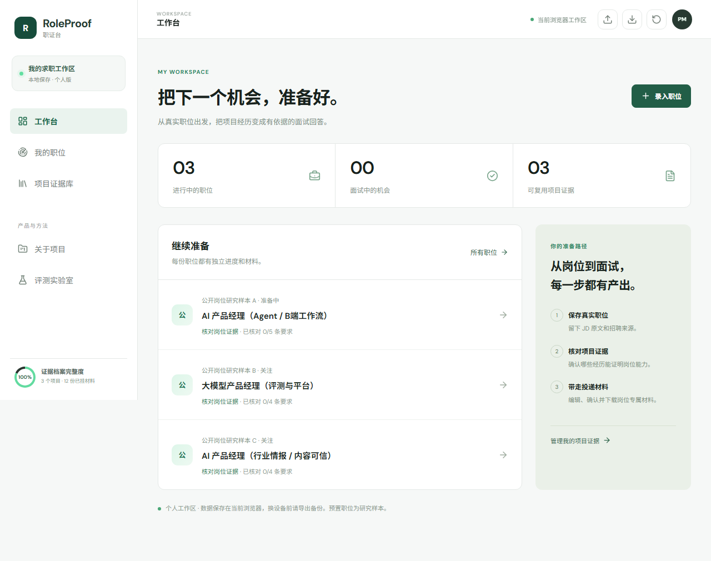
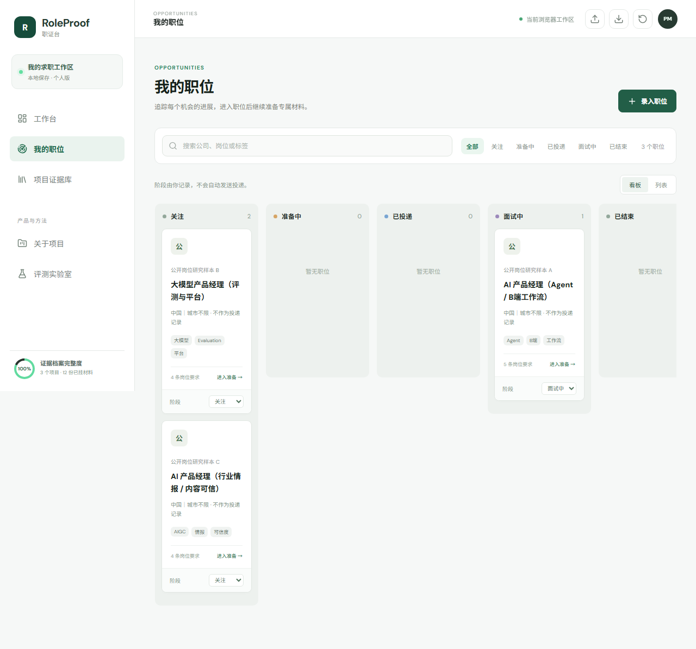
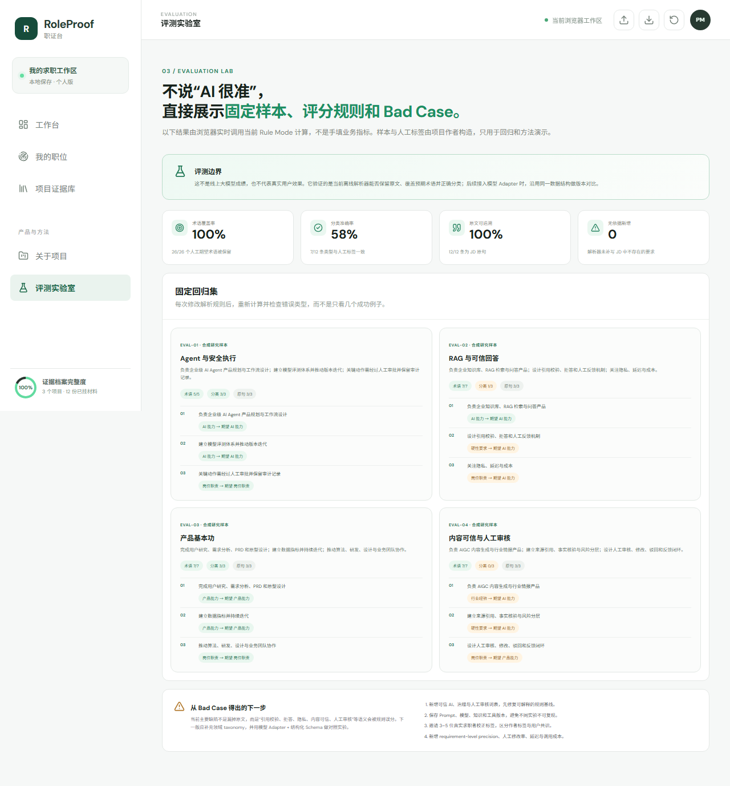
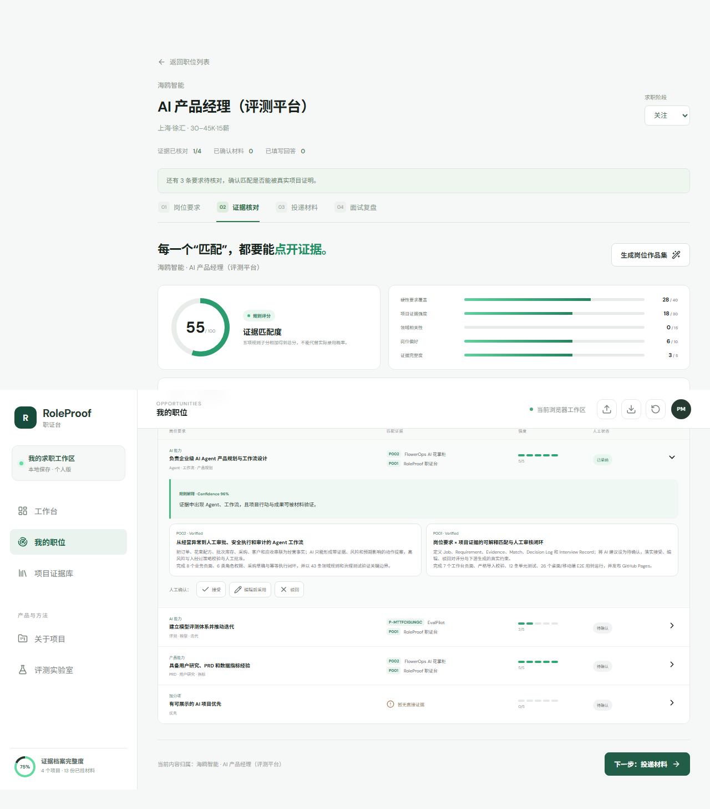
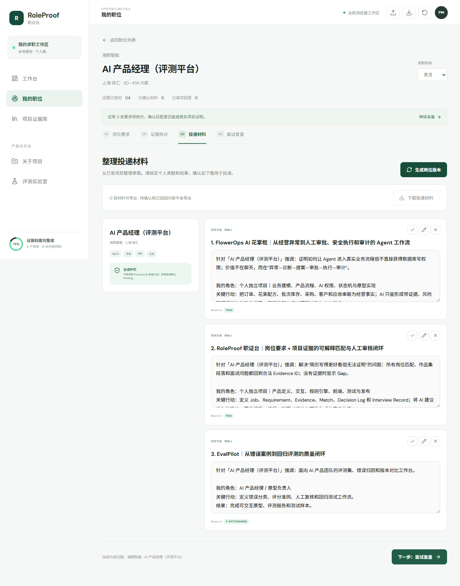
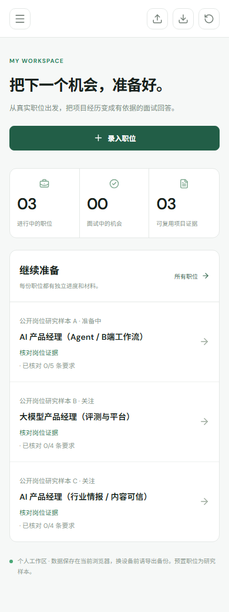

# RoleProof 职证台｜真实 AI 产品经理面试项目

> 把岗位要求、项目事实、人工判断和面试材料连接成一条可核验的求职决策链。

- 在线 Demo：https://2392772541.github.io/roleproof/
- GitHub：https://github.com/2392772541/roleproof
- 项目性质：个人独立作品
- 数据边界：默认职位与业务内容均为合成研究样本，不是本人真实投递、客户或商业成绩
- 最近验证：2026-09-09

## 为什么做

普通简历生成器能优化措辞，却很难回答：岗位要求来自哪句 JD、哪个项目能证明、哪些是事实、模型错了谁负责、系统如何评测。RoleProof 将核心资产从“生成文本”改为 `Evidence`：匹配、作品集和面试问题必须引用合法 Evidence ID；没有证据时显示 Gap，不编造经历。

## 当前真实交付

- 3 个主入口：工作台、我的职位、项目证据库；项目介绍与评测为辅助入口。
- 独立岗位路由：岗位要求 → 证据核对 → 投递材料 → 面试复盘，支持刷新、前进/后退与深链接。
- 五阶段职位看板、列表与搜索；每个岗位显示真实准备进度及下一步动作。
- 已确认或手工编辑的投递材料可下载为 Markdown，带项目来源链接；待确认/驳回内容不导出。
- 3 个真实公开项目证据：RoleProof、FlowerOps AI、SignalDesk。
- 3 组公开岗位研究样本，明确标注为非投递记录、非单一公司原版 JD。
- Accept / Edit / Reject 真正约束评分与下游生成。
- 严格 Schema、关系校验、localStorage 工作区与 JSON 导入导出。
- 固定离线评测集，实时计算术语覆盖、分类准确率、原文可追溯和无依据新增。
- Vitest、桌面/移动 Playwright、GitHub Actions 与 Pages。

## 产品闭环

```text
岗位研究 / 用户录入 JD
→ 保留来源和原文
→ 结构化 Requirement
→ Requirement × Evidence 推荐
→ 人工 Accept / Edit / Reject
→ 五维可解释评分
→ 岗位作品集
→ 面试问题与真实回答
→ Bad Case / 证据缺口回流
```

## 面试演示重点

1. **真实任务演示**：从工作台录入目标 JD，进入该职位独立工作区；更改阶段，返回看板验证，再刷新验证数据持久化。
2. **证据匹配**：演示 Reject 后强度归零且不能进入作品集；Edit 后改用人工选择的 Evidence ID。
3. **评测实验室**：展示固定样本、实时指标和分类 Bad Case，而不是说“AI 很准”。
4. **工程证据**：打开 GitHub、Actions、测试、文档和在线 Demo。
5. **稳定复现**：若浏览器保留旧工作区，先导出需要的数据，再点击顶部“恢复演示数据”；系统会二次确认，不会静默覆盖。

## 评测边界

评测集包含 4 条作者构造的中文 JD、12 条人工类型标签和 26 个期望术语，只验证当前 Rule Mode，不代表线上大模型或真实用户效果。

- 术语覆盖率：预期术语是否保留。
- 分类准确率：Requirement 类型是否与作者标签一致。
- 原文可追溯：解析结果是否为 JD 原句。
- 无依据新增：是否产生源文本不存在的要求。

当前 Bad Case 主要是“引用校验、拒答、隐私、内容可信、人工审核”等语义分类不足。下一版应扩展治理词表，再接入可替换模型 Adapter，并记录 Prompt、模型、知识和工具版本做对照。

## 可解释评分

```text
硬性要求覆盖 0–40
项目证据强度 0–30
领域相关性   0–15
岗位偏好     0–10
证据完整度    0–5
```

总分是准备优先级，不是录用概率。

## 截图








## 本地运行与验证

要求 Node.js 20+。

```bash
npm install
npm run dev
npm run check
npm run check:all
```

## 文档

- [工作区重新设计：问题、决策与验收](docs/workspace-redesign.md)
- [PRD](docs/PRD.md)
- [案例复盘与面试脚本](docs/case-study.md)
- [2026 岗位研究](docs/job-research-2026.md)
- [评测方案](docs/evaluation-plan.md)
- [AI 能力边界](docs/ai-boundary.md)
- [数据模型](docs/data-model.md)
- [竞品研究](docs/competitive-research.md)
- [可行性与缺陷审计](docs/feasibility-and-bug-audit.md)

## 尚未验证

- 尚无真实求职者任务完成率、证据采纳率或面试转化数据。
- 尚未连接招聘平台、附件存储、OCR 和真实大模型。
- 默认使用 localStorage，没有账号和跨设备同步。
- 下一步先邀请 3–5 位真实求职者完成同一任务，再决定模型和后端投入。

## License

MIT
